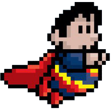

  <a href="https://escapekrypton.com">
    <picture>
      <source media="(prefers-color-scheme: dark)" srcset="./public/assets/images/chubby-superman-solo.png">
      
    </picture>
    <h1 align="center">Escape Krypton</h1>
  </a>

Escape Krypton is a Superman themed browser game based on the ever 
addicting *Flappy Bird*.  This is the 2022 remake of one of my capstone 
projects that I presented for Demo Day while attending the App Academy 
Web Development Boot Camp in 2015. It was originally written in Javascript and utilized HTML5 / Canvas. [Original Repo](http://github.com/mikeyshean/krypton)

## New for 2022

- Migrated codebase to TypeScript as a Next.js project using the t3 stack
- tRPC/Prisma backend to manage game sessions and leadboard rankings
- Twilio based SMS to be notified if you lose the #1 rank (just for fun)
- Ability to send one of a few pre-select messages to the person you knocked out of first place (more fun)
- Background sprites for that flying through space ambience

Read more details of the development process and general updates on my [blog](https://mikeyshean.com/blog)