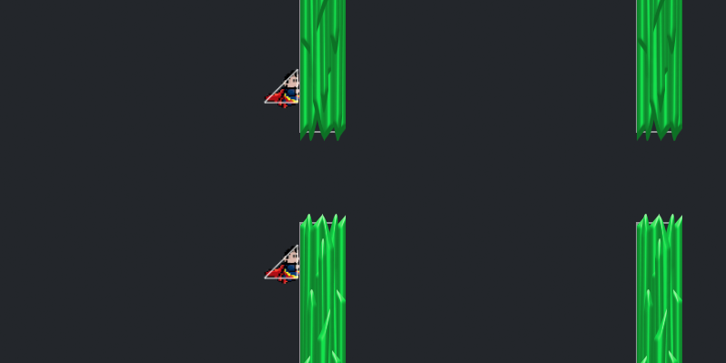
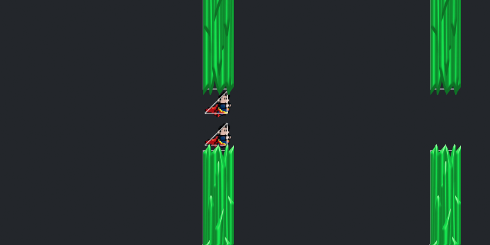
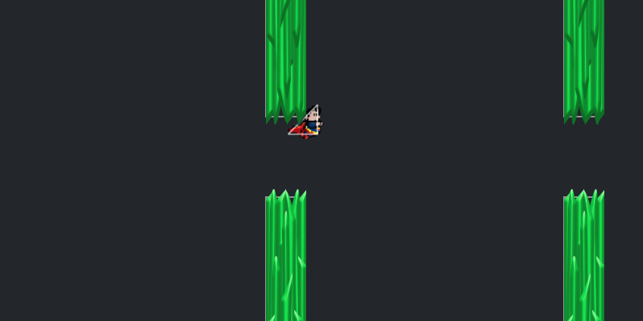

# Escape from Krypton

*Escape from Krypton* is a Superman themed browser game based on the ever addicting *Flappy Bird*.  It was originally written in Javascript and utilized HTML5 / Canvas. The original project can be found here: [Link](http://github.com/mikeyshean/krypton)

[Live][kryptonite]
[kryptonite]: http://mikeyshean.com/kryptonite

## To-do

- [ ] Instructions on Splash Page
- [ ] Scrolling floor/background
- [ ] Leaderboard
- [ ] Laser Vision Powerups!

## How to Play
- Press space, up, or use mouse-clicks to fly
- Avoid Kryptonite
- That's it!

## Features
- Utilizes duck typing for Kryptonite/Superman objects to dry up code
- Three customized collision detection methods
- Kryptonite drawn with Photoshop CC
- *Util* class created to abstract out repetitive code

## Collision Detection

In order to detect when Superman collides with a Kryptonite crystal I've
defined a "hit box" boundary around each that will be used to calculate 
when a collision occurs.  For this game we need three types of collision detection detailed below:

#### `sideCollision()`:
Here we detect when the right vertical edge of Superman's triangular "hit box" collides with the left edge of the Kryptonite.

#### `gapCollision()`:

Here we detect when the top point or bottom edge of Superman collides with the top/bottom edges of the Kryptonite within the gap.

#### `trigCollision()`:
Finally, we detect when the rear hypotenuse edge of Superman's hit box collides with the bottom edge of the top Kryptonite.

